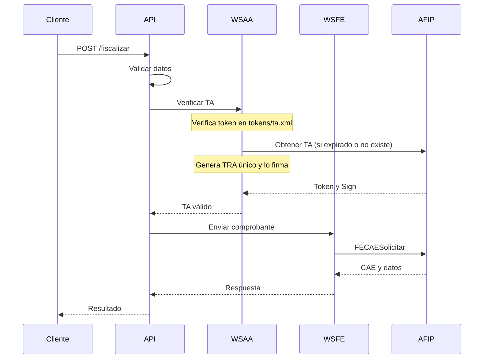

# Documentación Detallada - Fiscalizador ARCA API

## Índice
1. [Arquitectura del Sistema](#arquitectura-del-sistema)
2. [Tecnologías y Dependencias](#tecnologías-y-dependencias)
3. [Flujo de Trabajo](#flujo-de-trabajo)
4. [Endpoints y Métodos](#endpoints-y-métodos)
5. [Validaciones](#validaciones)
6. [Integración Frontend-Backend](#integración-frontend-backend)
7. [Ejemplos de Uso](#ejemplos-de-uso)
8. [Guías de Implementación](#guías-de-implementación)
9. [Solución de Problemas](#solución-de-problemas)

## Arquitectura del Sistema

### Componentes Principales

```
fiscalizador-api/
├── app/
│   ├── routes/          # Endpoints de la API
│   ├── services/        # Lógica de negocio
│   └── models/          # Modelos de datos
├── afip/
│   ├── wsaa.py         # Autenticación AFIP (WSAA)
│   ├── wsfe.py         # Servicio de Facturación Electrónica
│   └── wsfe_consulta.py # Consultas al servicio WSFE
├── tokens/             # Directorio para archivos de autenticación
│   ├── ta.xml         # Ticket de Acceso
│   ├── tra.xml        # Ticket de Requerimiento de Acceso
│   └── tra.cms        # TRA firmado
└── tests/              # Pruebas unitarias y de integración
```

### Diagrama de Flujo



## Tecnologías y Dependencias

### Backend
- **Python 3.8+**: Lenguaje principal
- **Flask 3.0.2**: Framework web
- **Flask-CORS**: Manejo de CORS
- **Flask-Limiter**: Rate limiting
- **Zeep**: Cliente SOAP para servicios AFIP
- **OpenSSL**: Manejo de certificados y firmas
- **lxml**: Procesamiento XML
- **logging**: Sistema de logs integrado

### Frontend
- **HTML/JavaScript**: Interfaz de usuario
- **Bootstrap**: Estilos y componentes
- **Fetch API**: Comunicación con backend

### Herramientas de Desarrollo
- **Git**: Control de versiones
- **logging**: Sistema de logs para debugging
- **OpenSSL**: Herramientas de línea de comandos

## Flujo de Trabajo

### 1. Autenticación
```python
# El sistema maneja automáticamente la autenticación:
# 1. Verifica si existe un TA válido en tokens/ta.xml
# 2. Si no existe o está expirado, genera uno nuevo
# 3. Guarda el nuevo TA en tokens/ta.xml

# Ejemplo de uso:
from afip.wsaa import obtener_ta, extraer_token_sign

# Obtener TA (maneja automáticamente la caché y renovación)
ta_xml = obtener_ta(CERT, KEY, servicio='wsfe')

# Extraer token y firma para usar en servicios
token, sign = extraer_token_sign(ta_xml)
```

### 2. Manejo de Tokens
- Los tokens se almacenan en el directorio `tokens/`
- El sistema verifica automáticamente la validez del token
- Se regenera automáticamente si está expirado o próximo a expirar
- Maneja reintentos en caso de errores de AFIP
- Limpia archivos temporales después de cada operación

### 3. Fiscalización
```python
# Ejemplo de envío de comprobante
def enviar_comprobante(token, sign, cuit, datos_cbte_xml):
    client = Client(SERVICIOS['wsfe'])
    response = client.service.FECAESolicitar(
        Auth={'Token': token, 'Sign': sign, 'Cuit': cuit},
        FeCAEReq=datos_cbte_xml
    )
```

## Endpoints y Métodos

### POST /fiscalizar

#### Parámetros
| Parámetro | Tipo | Descripción | Ejemplo |
|-----------|------|-------------|---------|
| tipo_comprobante | int | Tipo de comprobante | 1 (Factura A) |
| punto_venta | int | Punto de venta | 12 |
| doc_tipo | int | Tipo de documento | 96 (DNI) |
| doc_nro | string | Número de documento | "39612775" |
| cbte_fch | string | Fecha (YYYYMMDD) | "20240315" |
| imp_neto | float | Importe neto | 1000.00 |
| imp_iva | float | Importe IVA | 210.00 |
| imp_total | float | Importe total | 1210.00 |
| mon_id | string | Moneda | "PES" |
| concepto | int | Concepto | 1 (Productos) |

#### Respuesta Exitosa
```json
{
    "CAE": "75233247119284",
    "CAEFchVto": "20250615",
    "CbteNro": 27,
    "PtoVta": 12,
    "CbteTipo": 1,
    "resultado": "A"
}
```

#### Respuesta de Error
```json
{
    "error": "Error al obtener token AFIP: [descripción del error]"
}
```

## Validaciones

### 1. Validaciones de Datos
- Formato de DNI/CUIT
- Fechas válidas
- Importes positivos
- Suma de alícuotas
- Tipo de comprobante permitido

### 2. Validaciones AFIP
- Punto de venta habilitado
- Numeración correcta
- Fechas dentro de rangos permitidos
- Token válido y no expirado

## Integración Frontend-Backend

### Ejemplo de Componente HTML/JavaScript

```html
<form id="fiscalizadorForm">
    <!-- Campos del formulario -->
    <div id="resultado"></div>
</form>

<script>
async function fiscalizar(datos) {
    try {
        const response = await fetch('/fiscalizar', {
            method: 'POST',
            headers: {
                'Content-Type': 'application/json'
            },
            body: JSON.stringify(datos)
        });
        
        const resultado = await response.json();
        
        if (resultado.CAE) {
            mostrarExito(resultado);
        } else {
            mostrarError(resultado.error);
        }
    } catch (error) {
        mostrarError('Error de comunicación con el servidor');
    }
}
</script>
```

## Solución de Problemas

### Errores Comunes

1. **Error de Token**
   - Verificar que exista el directorio `tokens/`
   - Comprobar permisos de escritura en `tokens/`
   - Verificar certificados en `cert/`
   - Revisar logs para mensajes específicos

2. **Error de Validación**
   - Revisar formato de datos
   - Verificar rangos permitidos
   - Comprobar tipo de documento

3. **Error de Comunicación**
   - Verificar conectividad con AFIP
   - Revisar timeouts
   - Comprobar URLs de servicios

### Logs y Debugging

```python
# El sistema usa logging configurado en app.py
import logging

logger = logging.getLogger(__name__)
logger.info('Iniciando fiscalización')
logger.error('Error al obtener token: %s', str(error))
```

### Herramientas de Diagnóstico

1. **Logs del Sistema**
   - Revisar `logs/fiscalizador.log`
   - Analizar respuestas XML
   - Verificar trazas SOAP

2. **Archivos de Autenticación**
   - `tokens/ta.xml`: Ticket de Acceso
   - `tokens/tra.xml`: Ticket de Requerimiento
   - `tokens/tra.cms`: TRA firmado

3. **Pruebas de Integración**
   - Validar flujos completos
   - Probar casos límite
   - Verificar manejo de errores 