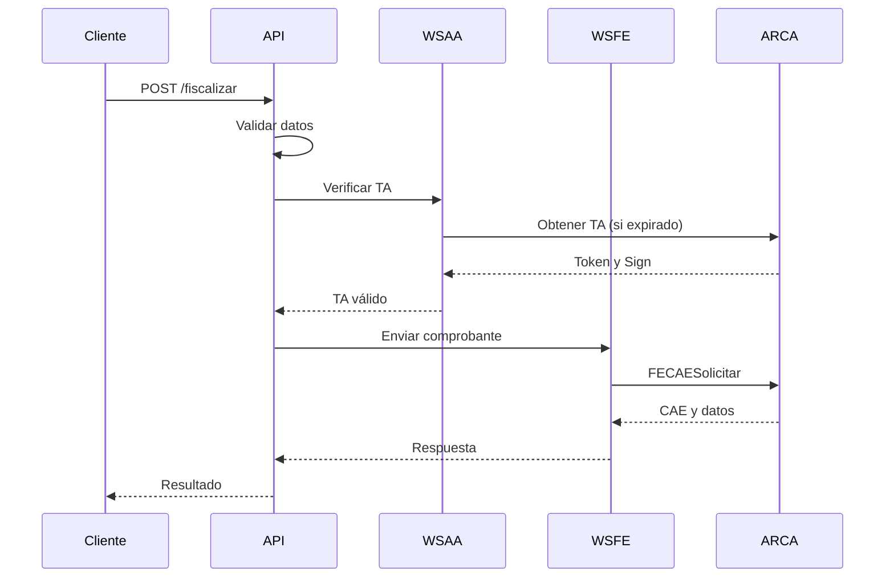

# Documentación Detallada - Fiscalizador ARCA API

## Índice
1. [Arquitectura del Sistema](#arquitectura-del-sistema)
2. [Tecnologías y Dependencias](#tecnologías-y-dependencias)
3. [Flujo de Trabajo](#flujo-de-trabajo)
4. [Endpoints y Métodos](#endpoints-y-métodos)
5. [Validaciones](#validaciones)
6. [Integración Frontend-Backend](#integración-frontend-backend)
7. [Ejemplos de Uso](#ejemplos-de-uso)
8. [Guías de Implementación](#guías-de-implementación)
9. [Solución de Problemas](#solución-de-problemas)

## Arquitectura del Sistema

### Componentes Principales

```
fiscalizador-api/
├── app/
│   ├── routes/          # Endpoints de la API
│   ├── services/        # Lógica de negocio
│   └── models/          # Modelos de datos
├── ARCA/
│   ├── wsaa.py         # Autenticación ARCA
│   ├── wsfe.py         # Servicio de Facturación Electrónica
│   └── config.py       # Configuración ARCA
└── tests/              # Pruebas unitarias y de integración
```

### Diagrama de Flujo



## Tecnologías y Dependencias

### Backend
- **Python 3.8+**: Lenguaje principal
- **FastAPI**: Framework web
- **Zeep**: Cliente SOAP para servicios ARCA
- **PyOpenSSL**: Manejo de certificados
- **Pydantic**: Validación de datos
- **SQLAlchemy**: ORM (opcional, para persistencia)

### Frontend (Recomendado)
- **React/Vue/Angular**: Framework frontend
- **Axios**: Cliente HTTP
- **Material-UI/Ant Design**: Componentes UI
- **React Query/SWR**: Manejo de estado y caché

### Herramientas de Desarrollo
- **Docker**: Contenedorización
- **Poetry**: Gestión de dependencias
- **Pytest**: Testing
- **Black**: Formateo de código
- **Flake8**: Linting

## Flujo de Trabajo

### 1. Autenticación
```python
# El sistema maneja automáticamente:
ta_xml = obtener_ta(CERT, KEY, servicio='wsfe')
token, sign = extraer_token_sign(ta_xml)
```

### 2. Validación de Datos
```python
# Ejemplo de validación de CUIT
def validar_cuit_receptor(token, sign, cuit):
    client = Client(SERVICIOS['ws_sr_padron_a5'])
    response = client.service.getPersona(
        token=token,
        sign=sign,
        cuitRepresentada=CUIT,
        idPersona=cuit
    )
```

### 3. Fiscalización
```python
# Ejemplo de envío de comprobante
def enviar_comprobante(token, sign, cuit, datos_cbte_xml):
    client = Client('https://wswhomo.ARCA.gov.ar/wsfev1/service.asmx?WSDL')
    response = client.service.FECAESolicitar(
        Auth={'Token': token, 'Sign': sign, 'Cuit': cuit},
        FeCAEReq=datos_cbte_xml
    )
```

## Endpoints y Métodos

### POST /fiscalizar

#### Parámetros
| Parámetro | Tipo | Descripción | Ejemplo |
|-----------|------|-------------|---------|
| tipo_comprobante | int | Tipo de comprobante | 1 (Factura A) |
| punto_venta | int | Punto de venta | 12 |
| doc_tipo | int | Tipo de documento | 80 (CUIT) |
| doc_nro | string | Número de documento | "20396127823" |
| cbte_fch | string | Fecha (YYYYMMDD) | "20240315" |
| imp_neto | float | Importe neto | 1000.00 |
| imp_iva | float | Importe IVA | 210.00 |
| imp_total | float | Importe total | 1210.00 |
| mon_id | string | Moneda | "PES" |
| concepto | int | Concepto | 1 (Productos) |
| condicion_iva_receptor | int | Condición IVA | 1 (Responsable Inscripto) |

#### Respuesta Exitosa
```json
{
    "CAE": "12345678901234",
    "CAEFchVto": "20240415",
    "CbteNro": 1,
    "PtoVta": 12,
    "CbteTipo": 1
}
```

#### Respuesta de Error
```json
{
    "error": "Error ARCA 10015: El comprobante ya existe"
}
```

### GET /ultimo-comprobante

#### Parámetros Query
| Parámetro | Tipo | Default | Descripción |
|-----------|------|---------|-------------|
| pto_vta | int | 12 | Punto de venta |
| cbte_tipo | int | 1 | Tipo de comprobante |

#### Respuesta
```json
{
    "ultimo_comprobante": {
        "punto_venta": 12,
        "tipo_comprobante": 1,
        "ultimo_numero": 123,
        "fecha_ultimo": "2024-03-15T10:30:00"
    },
    "siguiente_numero": 124
}
```

## Validaciones

### 1. Validaciones de Datos
- Formato de CUIT/DNI
- Fechas válidas
- Importes positivos
- Suma de alícuotas
- Condición IVA válida

### 2. Validaciones ARCA
- CUIT activo en padrón
- Punto de venta habilitado
- Tipo de comprobante permitido
- Numeración correcta
- Fechas dentro de rangos permitidos

## Integración Frontend-Backend

### Ejemplo de Componente React

```jsx
import React, { useState } from 'react';
import axios from 'axios';

function Fiscalizador() {
    const [datos, setDatos] = useState({
        tipo_comprobante: 1,
        punto_venta: 12,
        // ... otros campos
    });

    const fiscalizar = async () => {
        try {
            const response = await axios.post('/fiscalizar', datos);
            if (response.data.CAE) {
                // Mostrar CAE y datos
                mostrarExito(response.data);
            }
        } catch (error) {
            // Mostrar error
            mostrarError(error.response.data.error);
        }
    };

    return (
        <form onSubmit={fiscalizar}>
            {/* Campos del formulario */}
        </form>
    );
}
```

### Manejo de Errores

```javascript
// Frontend
const manejarError = (error) => {
    if (error.response) {
        switch (error.response.status) {
            case 400:
                // Error de validación
                mostrarErroresValidacion(error.response.data);
                break;
            case 401:
                // Error de autenticación
                regenerarTA();
                break;
            case 500:
                // Error del servidor
                mostrarErrorServidor();
                break;
        }
    }
};
```

## Ejemplos de Uso

### 1. Fiscalización Básica

```python
import requests

# Datos mínimos requeridos
datos = {
    "tipo_comprobante": 1,
    "punto_venta": 12,
    "doc_tipo": 80,
    "doc_nro": "20396127823",
    "cbte_fch": "20240315",
    "imp_neto": 1000.00,
    "imp_iva": 210.00,
    "imp_total": 1210.00,
    "mon_id": "PES",
    "concepto": 1,
    "condicion_iva_receptor": 1
}

response = requests.post('http://api/fiscalizar', json=datos)
```

### 2. Fiscalización con Alícuotas

```python
# Datos con alícuotas
datos = {
    # ... datos básicos ...
    "alicuotas": [
        {
            "Id": 5,  # 21%
            "BaseImp": 1000.00,
            "Importe": 210.00
        },
        {
            "Id": 4,  # 10.5%
            "BaseImp": 500.00,
            "Importe": 52.50
        }
    ]
}
```

### 3. Fiscalización con Tributos

```python
# Datos con tributos
datos = {
    # ... datos básicos ...
    "tributos": [
        {
            "Id": 99,
            "Desc": "Impuesto Municipal",
            "BaseImp": 1000.00,
            "Alic": 3.00,
            "Importe": 30.00
        }
    ]
}
```

## Guías de Implementación

### 1. Configuración Inicial

1. Obtener certificados ARCA
2. Configurar variables de entorno
3. Instalar dependencias
4. Probar en ambiente de homologación

### 2. Migración a Producción

1. Obtener certificados de producción
2. Actualizar URLs a producción
3. Verificar CUIT y punto de venta
4. Realizar pruebas de carga

### 3. Monitoreo

1. Implementar logging
2. Configurar alertas
3. Monitorear uso de TA
4. Seguimiento de errores

## Solución de Problemas

### Errores Comunes

1. **Error de Token**
   - Verificar certificados
   - Regenerar TA
   - Revisar fechas

2. **Error de Validación**
   - Revisar formato de datos
   - Verificar rangos permitidos
   - Comprobar CUIT activo

3. **Error de Comunicación**
   - Verificar conectividad
   - Revisar timeouts
   - Comprobar URLs

### Logs y Debugging

```python
# Ejemplo de logging
import logging

logging.basicConfig(
    level=logging.DEBUG,
    format='%(asctime)s - %(name)s - %(levelname)s - %(message)s',
    filename='fiscalizador.log'
)

logger = logging.getLogger('fiscalizador')
logger.debug('Enviando comprobante: %s', datos)
```

### Herramientas de Diagnóstico

1. **Logs de ARCA**
   - Revisar respuestas XML
   - Analizar códigos de error
   - Verificar trazas SOAP

2. **Monitoreo de Sistema**
   - Uso de CPU/Memoria
   - Tiempos de respuesta
   - Errores HTTP

3. **Pruebas de Integración**
   - Validar flujos completos
   - Probar casos límite
   - Verificar reconexiones 